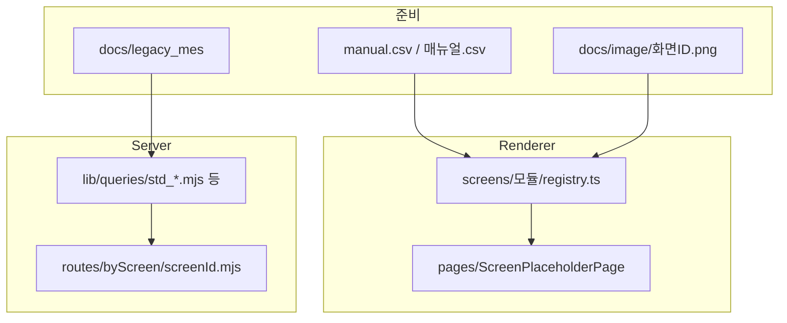

# BK MES — 신규 개발자 인수인계

이 문서는 **레거시 WinForms MES와 동일한 기능**을 웹/Electron 클라이언트로 구현·정합하기 위한 **작업 순서**와 **참조해야 할 문서·코드 위치**를 한곳에 모은다. 세부 규칙은 링크된 MD·소스가 정본이며, 본 문서는 요약·체크리스트 역할을 한다.

**번호 체계**: 아래처럼 **1.2.3**과 **1.2.4**를 구분한다(요청서에 1.2.4가 중복되어 있던 경우의 정리).

| 절 | 내용 |
|----|------|
| 1.2.1 | PNG·매뉴얼 기준으로 화면 ID별 UI 구성 |
| 1.2.2 | 레거시 Oracle 의도 파악 → PostgreSQL BE (`lib/queries`, `byScreen`) |
| **1.2.3** | 구현한 페이지에 BE 연동 (API·프록시·베이스 URL) |
| **1.2.4** | 레거시 MES 동작·메시지와 비교하며 수정 (`project-rules.md` §6.0.3) |

---

## 1. 레거시와 동일 기능 개발 — 작업 순서

### 1.1 준비 작업

#### 1.1.1 실제 MES 화면 캡처 → PNG (`docs/image`)

1. **파일 규칙**  
   - 경로: **`docs/image/<화면ID>.png`**  
   - `<화면ID>`는 [`renderer/src/data/manual.csv`](../renderer/src/data/manual.csv)의 **화면 ID** 열과 **완전히 동일**해야 한다.  
   - 상세: [`project-rules.md`](../project-rules.md) **§6.0** (매뉴얼·PNG·Chrome·타이틀).

2. **PNG 존재 확인**  
   - §6.0에 따라 **glob/인덱스만으로 “없음” 판단하지 말 것**. IDE·터미널·직접 Read 등으로 실제 파일을 확인한다.

3. **레이아웃 정합**  
   - 조회줄·그리드·상세 폼: [`docs/LAYOUT_RULES.md`](LAYOUT_RULES.md)  
   - 모듈별 PNG 정합 이력·패턴 참고: [`docs/MODULE_PNG_SYNC.md`](MODULE_PNG_SYNC.md)  
   - 빌드에 포함된 PNG 판별: 스플래시 등은 `@docs/image` import 패턴 — 상세는 [`PROJECT_STRUCTURE.md`](PROJECT_STRUCTURE.md)·`ScreenPlaceholderPage` / `MesScreenAccessDeniedModal` 흐름 참고.

4. **런타임 동작**  
   - `docs/image/<화면ID>.png`가 **빌드에 포함되지 않으면** [`renderer/src/pages/ScreenPlaceholderPage.tsx`](../renderer/src/pages/ScreenPlaceholderPage.tsx)에서 [`MesScreenAccessDeniedModal`](../renderer/src/components/MesScreenAccessDeniedModal.tsx) 등 접근 안내 흐름이 적용된다(§6.0).

**체크리스트**

- [ ] `manual.csv` / [매뉴얼.csv](매뉴얼.csv)와 화면 ID 일치
- [ ] `docs/image/<화면ID>.png` 실제 존재 확인
- [ ] 조회줄·그리드 열 순서·라벨이 PNG와 맞는지 [`LAYOUT_RULES.md`](LAYOUT_RULES.md) 기준 검토

---

#### 1.1.2 레거시 MES 코드 입수 — `docs/legacy_mes`

1. **폴더 구조**  
   - 개요: [`docs/legacy_mes/README.md`](legacy_mes/README.md)  
   - 현재 저장소에는 **`Basis/`** 아래 기준정보 모듈(`2S_MES_Basis`, `_2S_MES_Basis` 폼 등)이 보관된 예시가 있다. 다른 모듈 C#은 **`docs/legacy_mes/<모듈명>/`** 와 같이 **동일 레벨**에 폴더를 추가하면 된다.

2. **화면 ID ↔ 레거시 C# 폼**  
   - **기준정보 `std_*`**: [`docs/DATABASE.md`](DATABASE.md) 표 **「기준정보 모듈 화면 ID ↔ 레거시 C#」**  
   - MDI에서 자식 창 열기: [`docs/legacy_mes/Basis/_2S_MES_Basis/frmMDIMain.cs`](legacy_mes/Basis/_2S_MES_Basis/frmMDIMain.cs) 의 `OpenChildWindow` 매핑을 1차 참고  
   - 절차 요약: `legacy_mes/README.md` 「화면 작업 시 사용 방법」

3. **충돌 시 우선순위** ([`project-rules.md`](../project-rules.md) **§6.0.3**)  
   1. **`docs/image/<화면ID>.png`**  
   2. **`docs/legacy_mes`** (`frm*.cs`, 필요 시 `frm*.resx`)  
   3. **[`docs/DATABASE.md`](DATABASE.md)** · **[`docs/db-doc/<화면ID>_api.md`](db-doc/)**

**체크리스트**

- [ ] 대상 화면에 대응하는 `frm*.cs` 경로 파악(없으면 db-doc/코드에 **레거시 N/A** 가능, §6.0.3)
- [ ] 저장·삭제·조회·검증이 연결된 메서드 이름 메모 (`gSave`, `cmdSearch_Click` 등)

---

### 1.2 개발 작업

#### 1.2.1 PNG·매뉴얼 기준 화면 ID 페이지 구성

1. **데이터 원본**  
   - [`renderer/src/data/manual.csv`](../renderer/src/data/manual.csv) ↔ [매뉴얼.csv](매뉴얼.csv) **4열 동기화** (§6.0.1). 한쪽만 수정하지 말 것.

2. **라우팅**  
   - Hash: `#/screens/<화면ID>` — [`renderer/src/App.tsx`](../renderer/src/App.tsx)  
   - 기준정보 예: [`renderer/src/screens/std/registry.ts`](../renderer/src/screens/std/registry.ts)

3. **UI 골격**  
   - [`BaseFeatureScreen`](../renderer/src/components/BaseFeatureScreen.tsx), [`MesScreenShell`](../renderer/src/screens/std/MesScreenShell.tsx)  
   - 그리드: [`MesDataGridPanel`](../renderer/src/components/MesDataGridPanel.tsx)  
   - 행 상세: [`MesDetailForm`](../renderer/src/components/MesDetailForm.tsx)  
   - 조회 스트립: [`MesSearchSaveBar`](../renderer/src/components/MesSearchSaveBar.tsx)  
   - 디렉터리 설명: [`docs/PROJECT_STRUCTURE.md`](PROJECT_STRUCTURE.md)

4. **마스터–상세 성능**  
   - [`.cursor/rules/mes-master-detail-performance.mdc`](../.cursor/rules/mes-master-detail-performance.mdc) (`onSelectRow` 의존성, `virtualizeRows` 등)

**체크리스트**

- [ ] `registry.ts`(또는 해당 모듈)에 화면 등록
- [ ] `BaseFeatureScreen`에 `screenId`·타이틀 경로 전달 (§6.0)

---

#### 1.2.2 레거시 Oracle 의도 → PostgreSQL BE

1. **원칙**  
   - C# 안의 **Oracle SQL·`TB_*` 물리명을 그대로** Node 서버에 넣지 않는다 (§6.0.3, §4.2).  
   - 레거시는 **테이블·컬럼·검증·저장 순서·트랜잭션 의도** 파악용.

2. **서버 구조**  
   - 화면 진입점: [`server/src/routes/byScreen/README.md`](../server/src/routes/byScreen/README.md) — 파일명 **`<screenId>.mjs`**, `manual.csv`와 1:1  
   - SQL·라우터 구현: [`server/src/lib/queries/README.md`](../server/src/lib/queries/README.md) — 모듈 전용 **`std_*` / `prd_*` / `mat_*` / `mfg_*` / `pur_*`** 접두, 공통 예외(`authAndSplash.mjs` 등)

3. **등록**  
   - [`server/src/index.mjs`](../server/src/index.mjs)에서 `create…Router()` 를 `app.use` — **누락 시 API가 열리지 않음**.

4. **중복 경로 금지**  
   - 동일 HTTP path를 **두 개의 `byScreen`**에서 각각 `app.use` 하지 않는다. 공용 구현은 `lib/queries` 한 곳, 마운트는 한 화면 진입점 (§4.2).

**체크리스트**

- [ ] `byScreen/<screenId>.mjs` 추가
- [ ] `lib/queries`에 모듈 접두 맞는 구현 파일
- [ ] `index.mjs` 등록

---

#### 1.2.3 페이지–BE 연동

1. **베이스 URL**  
   - 사용자·STD 공통 API: [`renderer/src/lib/userMgmtBeBaseUrl.ts`](../renderer/src/lib/userMgmtBeBaseUrl.ts)  
   - MES DB API(해당 화면): [`renderer/src/lib/mesDbBaseUrl.ts`](../renderer/src/lib/mesDbBaseUrl.ts)

2. **Vite 프록시**  
   - [`renderer/vite.config.ts`](../renderer/vite.config.ts) — 개발 시 `/api` 등 백엔드로 전달

3. **화면별 API 메모**  
   - [`docs/db-doc/`](db-doc/) — 기준정보 통합 표: [`std_module_basis_info_overview.md`](db-doc/std_module_basis_info_overview.md)

4. **메뉴 접근·접속 로그**  
   - `POST /api/menu-access` — [`server/src/lib/screenFormCodeMap.mjs`](../server/src/lib/screenFormCodeMap.mjs)  
   - 웹 `screen_id` ↔ DB `form_code` 불일치 가능 — [`docs/DATABASE.md`](DATABASE.md) §4.2, [`docs/db-doc/std_base_user_log_inq_api.md`](db-doc/std_base_user_log_inq_api.md)

**체크리스트**

- [ ] 화면에서 호출하는 엔드포인트가 `db-doc` 또는 코드와 일치
- [ ] 권한·로그가 필요한 화면은 `screenFormCodeMap`·`DATABASE.md` 정합

---

#### 1.2.4 레거시 대비 동작·메시지 정합

1. **절차** ([`project-rules.md`](../project-rules.md) **§6.0.3**)  
   - `frm*.cs`에서 그리드·버튼·`MessageBox` 문구를 목록화  
   - 웹에서는 **문구 취지 동일** — 배너, `confirm`, 모달 등 기존 패턴 유지 (동기 `alert` 남용 지양)

2. **검증**  
   - STD BE 스모크: [`docs/SMOKE_STD_BE.md`](SMOKE_STD_BE.md), 루트 `npm run smoke:be`  
   - 저장소 규약: `npm run check:ai-harness` / `npm run check:ai-harness:strict` — [`scripts/check-ai-harness.mjs`](../scripts/check-ai-harness.mjs)

**체크리스트**

- [ ] 저장/삭제/검증 실패 메시지가 레거시와 실무적으로 동등한지  
- [ ] `check:ai-harness` 통과

---

## 2. 저장소 문서 지도 (부록 A)

전체 목록의 색인: [`docs/DOCUMENTATION_INDEX.md`](DOCUMENTATION_INDEX.md)

| 구분 | 문서·위치 |
|------|-----------|
| 필수 | [`CONTEXT.md`](CONTEXT.md), [`SETUP.md`](SETUP.md), [`PROJECT_STRUCTURE.md`](PROJECT_STRUCTURE.md), [`DATABASE.md`](DATABASE.md), [`LAYOUT_RULES.md`](LAYOUT_RULES.md), 루트 [`project-rules.md`](../project-rules.md) §4·§6 |
| 레거시 | [`legacy_mes/README.md`](legacy_mes/README.md), `DATABASE.md` 표, §6.0.3 |
| BE | [`server/src/routes/byScreen/README.md`](../server/src/routes/byScreen/README.md), [`server/src/lib/queries/README.md`](../server/src/lib/queries/README.md), [`SMOKE_STD_BE.md`](SMOKE_STD_BE.md) |
| API 상세 | [`docs/db-doc/*_api.md`](db-doc/), [`std_module_basis_info_overview.md`](db-doc/std_module_basis_info_overview.md) |
| 이력·작업 | [`CHANGELOG.md`](CHANGELOG.md), [`TODO.md`](TODO.md), [`USER_PROMPTS_LOG.md`](USER_PROMPTS_LOG.md)(워크플로: 질문 선행·답 요약) |
| 대외(선택) | [`VENDOR_PROJECT_REPORT.md`](VENDOR_PROJECT_REPORT.md) |

**루트 규칙 파일 (역할 한 줄)**

- [`.cursorrules`](../.cursorrules): Cursor IDE 전용 — 코드 인용·도구·워크플로; 범용은 `project-rules.md` 우선  
- [`ai-rules.md`](../ai-rules.md): Cursor 외 AI용 **`project-rules.md` 위임·표** — 본문 중복 없음

**페이지 DB 분석 워크플로** (트리거 문구로 `docs/db-doc` 갱신 시): [`.cursor/rules/page-db-analysis-workflow.mdc`](../.cursor/rules/page-db-analysis-workflow.mdc)

---

## 3. 코드 앵커 (데이터 흐름)

---

## 4. BK MES.docx (부록 B)

- **의도된 경로**: `docs/BK MES.docx` (팀에서 배포하는 Word 원본이 있을 경우 이 위치에 두면 찾기 쉽다.)  
- **현재 저장소**: 워크스페이스에 해당 파일이 **없을 수 있다**. 사내 공유 드라이브·메일 등에서 확보 후, 필요하면 위 경로에 복사한다.  
- **본 저장소 문서와의 관계**: `BK MES.docx`에만 있는 요구·용어·조직 절차는 **이 MD에 중복 없이** 부록으로 요약하거나, Word를 정본으로 두고 **상충 시 저장소 `project-rules.md`·최신 MD를 우선**한다고 팀에서 합의한다.  
- **텍스트 추출**: Pandoc, Word에서 다른 이름으로 저장(HTML/텍스트) 등 사내 허용 도구 사용.

---

## 5. 신규 인력 온보딩 순서 (요약)

1. [`SETUP.md`](SETUP.md)로 `npm ci`·`npm run dev`까지 실행.  
2. [`project-rules.md`](../project-rules.md) §6.0·§6.0.1·§6.0.3과 [`LAYOUT_RULES.md`](LAYOUT_RULES.md) 훑기.  
3. 담당 화면의 **PNG** → **legacy_mes `frm*.cs`** → **DATABASE / db-doc** 순으로 읽기.  
4. FE 등록 후 BE·연동·정합(본 문서 1.2).  
5. PR 전 `npm run check:ai-harness` (및 CI와 동일한 검사).

---

*문서 추가·갱신 시 [`docs/CHANGELOG.md`](CHANGELOG.md)와 [`docs/DOCUMENTATION_INDEX.md`](DOCUMENTATION_INDEX.md)를 함께 수정한다 (`project-rules.md` §8).*

**HTML**: 브라우저용 단일 파일은 [`HANDOVER_NEW_DEVELOPER.html`](HANDOVER_NEW_DEVELOPER.html). MD 수정 후 재생성: `node scripts/render-db-doc-html.mjs docs/HANDOVER_NEW_DEVELOPER.md docs/HANDOVER_NEW_DEVELOPER.html` (Mermaid 블록은 코드 블록으로 표시됨).

**오프라인 번들(링크 대상 포함)**: `D:\smkang_data\docs\mes\handover` — MES 루트와 동일한 상대 경로로 복사. 열기: `index.html` 또는 `docs/HANDOVER_NEW_DEVELOPER.html`. 갱신: `node scripts/copy-handover-to-smkang.mjs`
