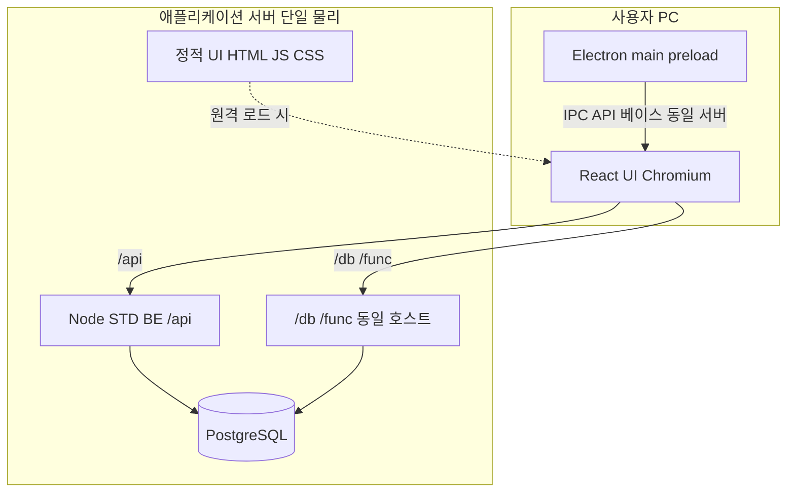
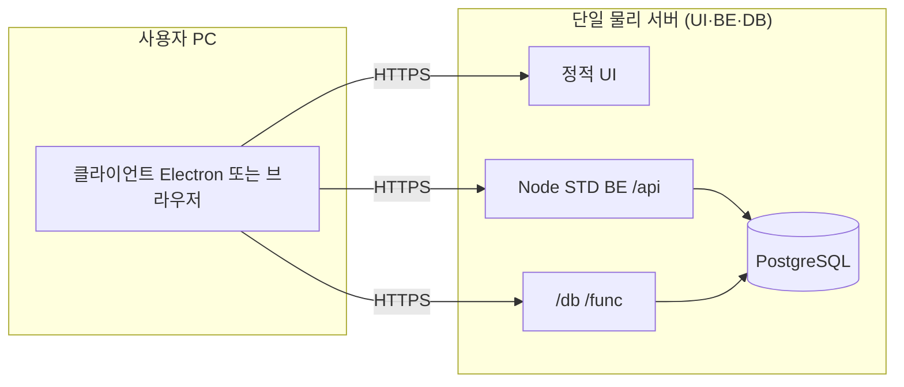
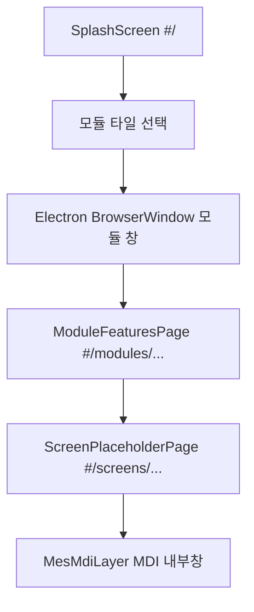
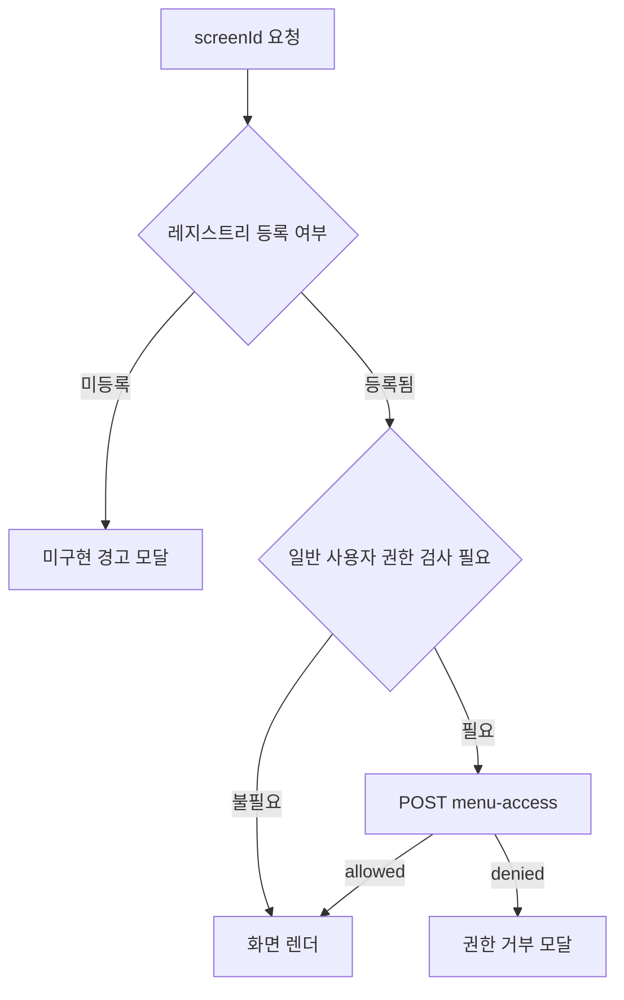
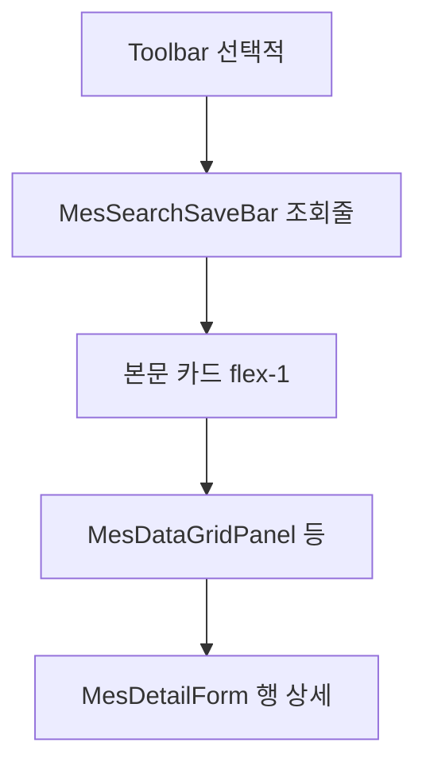

# BK MES — 발주업체용 프로젝트 정리 보고서

**문서 목적**: 저장소 기준으로 데스크톱 MES 클라이언트의 **기술 구성**, **UI·내비게이션 구조**, **화면 인벤토리**, **백엔드 연동 범위**를 발주·검수 측에 전달한다.  
**근거 소스**: [README.md](../README.md), [docs/CONTEXT.md](CONTEXT.md), [docs/PROJECT_STRUCTURE.md](PROJECT_STRUCTURE.md), [docs/LAYOUT_RULES.md](LAYOUT_RULES.md), [renderer/src/data/manual.csv](../renderer/src/data/manual.csv), [renderer/src/screens/registry.tsx](../renderer/src/screens/registry.tsx).

---

## 1. 개요

| 항목 | 내용 |
|------|------|
| 프로젝트명 | BK MES (BK_MES) |
| 형태 | **Electron** 데스크톱 셸에서 **Vite + React** 렌더러를 구동하는 MES UI |
| 목표 | WinForms 레거시를 대체하는 **화면 ID 기준** 웹 기술 스택 UI, PostgreSQL 기반 백엔드와 HTTP 연동 |
| 매뉴 정의 | `docs/매뉴얼.csv` ↔ `renderer/src/data/manual.csv` (4열: 모듈명, 메뉴, 하위메뉴, 화면 ID) |

스플래시 첫 화면에는 **6개 모듈 타일**(기준정보·제품관리·자재관리·생산관리·구매관리·SCM)이 표시되며, **SCM**은 사양 미정으로 비활성화될 수 있다. 매뉴 CSV에 정의된 모듈은 **5개**(기준정보~구매관리)이다.

---

## 2. 기술 스택

| 구분 | 기술 |
|------|------|
| Desktop | Electron (`electron/main.cjs`, `preload.cjs`) |
| UI | React, TypeScript, Tailwind CSS v4, `HashRouter` |
| 빌드 | Vite, Electron Builder(패키징) |
| 기준정보 전용 BE | Node.js **Express** — `server/` (기본 포트 **8787**), PostgreSQL 직접 접속 |
| 기타 데이터 경로 | 렌더러에서 `mesDbUrl()` 등으로 **`/db`**, **`/func`** 게이트웨이 사용 가능(모듈·화면별) |

---

## 3. 시스템 구성 (클라이언트 ↔ BE ↔ DB)

**발주·운영 전제(본 문서 기준)**: **UI(정적 자산)·BE(Node)·DB(PostgreSQL)를 한 대의 물리 서버(또는 동일 호스트)에 두는 구성**이다. 사용자 PC는 **클라이언트만** 실행하고, 화면·API·DB는 **동일 서버**에서 서비스한다(리버스 프록시로 포트·경로만 나누는 형태 포함).

BK MES는 **렌더러(React UI)** 가 HTTP로 데이터에 접근한다. **기준정보(STD)** 는 **Node Express** 가 PostgreSQL에 직접 붙고, **`/db`·`/func`** 는 코드상 **별도 베이스 URL** 을 쓸 수 있으나, **단일 서버 배포**에서는 **같은 호스트**에 두고 `VITE_USER_MGMT_API_BASE`·`VITE_MES_DB_API_BASE` 를 **동일 오리진**(또는 동일 서버의 다른 포트를 프록시로 묶음)으로 맞추면 된다.

### 3.0 역할·물리 구분 (사용자 PC ↔ 단일 서버)

| 구분 | 위치 | 내용 |
|------|------|------|
| **사용자 PC** | 현장 단말 | **Electron** 셸 + **Chromium** + (로컬 번들 또는 원격 로드) **React UI**, `mes-config.ini`에 **서버 호스트**(`USER_MGMT_API_BASE` 등)를 지정해 **한 서버**로만 요청을 보낸다. |
| **애플리케이션 서버 (단일 물리)** | 동일 머신 | **정적 UI**(`index.html`·JS·CSS) + **Node STD BE**(`/api`) + **PostgreSQL**. 웹 서버·리버스 프록시(예: nginx)가 **한 IP/호스트**에서 `/`는 UI, `/api`는 Node, DB는 **로컬 소켓** 등으로 연결하는 구성이 전형적이다. |
| **(참고) 분리 배포** | 별도 호스트 | 규모·보안 요구에 따라 UI·BE·DB·게이트웨이를 **물리적으로 나눌 수 있음** — 이 경우에만 이전처럼 “내부/외부 서버”로 도식한다. |



- **정적 UI**: **로컬 패키징**이면 `StaticUI` 없이 **사용자 PC**에만 번들이 있고, **원격 배포**이면 같은 **단일 서버**의 `StaticUI`에서 내려받는다.
- **`/db`·`/func`**: **동일 물리 서버** 안에서 **별도 프로세스/경로**일 수 있으나, **호스트는 BE·UI와 같게** 맞추는 것이 전제다(리버스 프록시로 한 IP에 묶음).

### 3.1 논리 구성도 (UI 프로세스 내부)

```mermaid
flowchart TB
  subgraph shell [Desktop Shell]
    ElectronMain[Electron main preload]
    Renderer[Chromium Renderer]
  end
  subgraph ui [React 앱]
    Router[HashRouter]
    Fetch["fetch userMgmtBeUrl mesDbUrl"]
  end
  subgraph stdbe [Node STD BE server]
    Express[Express app]
    ByScreen["routes/byScreen/std_*.mjs"]
    Queries["lib/queries/*.mjs"]
    Pool[pg pool]
  end
  subgraph gw [DB 게이트웨이 선택적]
    LegacyHTTP["/db /func 동일 서버 가능"]
  end
  subgraph pg [PostgreSQL]
    TBCM["tb_cm_*"]
    TBMES["tb_mes_*"]
  end
  ElectronMain -->|IPC 베이스 URL| Renderer
  Renderer --> Router
  Router --> Fetch
  Fetch -->|"/api/*"| Express
  Fetch -->|"/db" "/func"| LegacyHTTP
  Express --> ByScreen
  ByScreen --> Queries
  Queries --> Pool
  Pool --> TBCM
  Pool --> TBMES
```

### 3.2 HTTP 경로 구분

| 경로 접두 | 담당 | 용도 |
|-----------|------|------|
| **`/api/*`** | **`server/`** Express (저장소) | 사용자·공통코드·권한·cfg·공정라인·`menu-access`·사용자 LOG 등 **STD 전용 REST** |
| **`/db/*`**, **`/func/*`** | **MES DB API** (게이트웨이) | 레거시·타 모듈 화면에서 `mesDbUrl()` 로 호출. **단일 물리 서버** 전제에서는 **UI·`/api`와 동일 호스트**로 두고 경로만 나누는 구성이 가능하다. |
| **`/api/health`** | STD BE | DB `SELECT 1` 로 연결 확인 |

엔드포인트 목록은 [server/README.md](../server/README.md), 테이블·화면 매핑은 [docs/DATABASE.md](DATABASE.md)를 본다.

### 3.3 STD 백엔드(`server/`) 내부

- **진입**: [server/src/index.mjs](../server/src/index.mjs) — `PORT`(기본 **8787**), JSON 본문, CORS 허용, `trust proxy` 옵션.
- **라우팅**: 화면별 **`createStd…Router()`** 를 `app.use` 로 마운트 — 구현 SQL·비즈니스는 주로 **`lib/queries/*.mjs`**, 화면 ID 1:1 진입은 **`routes/byScreen/std_<screenId>.mjs`** ([project-rules.md](../project-rules.md) §4.2).
- **DB**: `pg` 풀로 PostgreSQL 연결 — `.env` 의 `DATABASE_URL` 또는 `PG*` 변수([server/README.md](../server/README.md)).

### 3.4 렌더러에서 베이스 URL 결정

**STD `/api` (userMgmt)**

우선순위는 [userMgmtBeBaseUrl.ts](../renderer/src/lib/userMgmtBeBaseUrl.ts) 와 동일하다.

1. **`window.__MES_USER_MGMT_API_BASE__`** — Electron `main.tsx` 부트스트랩에서 **`mes.getUserMgmtApiBase()`** IPC로 설정(값은 **`mes-config.ini`** 의 `USER_MGMT_API_BASE`, 또는 `UI_URL` + `USER_MGMT_API_PORT` 조합).
2. **`VITE_USER_MGMT_API_BASE`** (빌드 시 주입).
3. **개발 모드**에서 위가 비면 **상대 경로 `/api`** — 브라우저가 아닌 Vite가 받아 **프록시**로 STD BE에 넘김.

**`/db`·`/func` (mesDb)**

[mesDbBaseUrl.ts](../renderer/src/lib/mesDbBaseUrl.ts) 기준:

- **개발(`import.meta.env.DEV`)**: 베이스 빈 문자열 → 요청은 **`/db`…** 상대 경로 — Vite `server.proxy` 가 게이트웨이로 전달(CORS 회피).
- **프로덕션**: **`VITE_MES_DB_API_BASE`** 가 있으면 사용, 없으면 코드상 기본 호스트(환경별로 빌드·설정에서 교체).

### 3.5 개발 서버(Vite) 프록시

[renderer/vite.config.ts](../renderer/vite.config.ts) 에서 **`/api`** 대상은 다음 순으로 결정된다.

1. 환경 변수 **`MES_USER_MGMT_PROXY_TARGET`**
2. **`mes-config.ini`** 의 `USER_MGMT_API_BASE` 또는 `UI_URL` + `USER_MGMT_API_PORT`(기본 포트 8787)
3. 폴백 **`http://localhost:8787`**

**`/db`·`/func`** 는 개발 시 프록시 `target` 으로 지정된 게이트웨이 호스트로 전달된다. **운영**에서는 `VITE_MES_DB_API_BASE` 등으로 지정하며, **단일 물리 서버** 전제라면 **`VITE_USER_MGMT_API_BASE` 와 동일 호스트**(경로만 `/db`·`/api` 구분)로 맞추면 된다.

### 3.6 Electron vs 브라우저만 실행

| 실행 방식 | STD `/api` 접근 |
|-----------|-----------------|
| **Electron** | IPC로 절대 베이스 URL 주입 → `fetch` 가 해당 호스트로 **`/api/...`** 요청 |
| **`npm run dev` (브라우저)** | 베이스 없음 → **동일 오리진**의 `/api` → Vite 프록시 → 로컬 STD BE |

### 3.7 요약 다이어그램 (사용자 PC ↔ 단일 애플리케이션 서버)



- **한 대의 서버**에 **정적 UI·Node BE·PostgreSQL**이 함께 있고, 클라이언트는 **같은 호스트**(또는 프록시로 묶인 동일 사이트)로만 통신한다.  
- **로컬 패키징**(UI 번들이 PC에만 있음)이면 `UIfiles`로의 HTTP는 없고, **`/api`·`/db`** 만 서버로 향한다.

- 상세 엔드포인트: [server/README.md](../server/README.md)  
- 스키마·화면 매핑: [docs/DATABASE.md](DATABASE.md)

---

## 4. UI·내비게이션 구조

라우팅은 **`HashRouter`** 이다. 주요 경로는 [renderer/src/App.tsx](../renderer/src/App.tsx)에 정의된다.

| 경로 | 화면 | 역할 |
|------|------|------|
| `#/` | `SplashScreen` | 앱 시작·모듈 선택·로그인/비밀번호 모달 |
| `#/module/:moduleName` | `ModuleBlankPage` | Electron이 연 **모듈 전용 창** 최초 진입 시 빈 화면 |
| `#/modules/:moduleName` | `ModuleFeaturesPage` | 해당 모듈의 **메뉴 그룹별 화면 목록**(타일/버튼) |
| `#/screens/:screenId` | `ScreenPlaceholderPage` | 실제 기능 화면 또는 접근 불가 안내 |

---

### 4.1 런타임 흐름(요약)



---

### 4.2 메인 창 vs 모듈 창

| 구분 | 메인 창 | 모듈 창(기준정보~구매관리) |
|------|---------|---------------------------|
| 크기·메뉴 | 고정(예: 800×600)·**인앱 메뉴 바 없음** | 별도 `BrowserWindow`, **시스템 메뉴**(파일·모듈 매뉴·Window·도움말) |
| 진입 | 스플래시만 | 스플래시에서 모듈 타일 클릭 시 IPC로 새 창 |
| MDI | 없음 | **5개 모듈**(기준정보·제품·자재·생산·구매)은 **단일 툴바 + `MesMdiLayer`** 로 다중 내부창 — [project-rules.md](../project-rules.md) §6.0.1·§6.0.2 |
| 타이틀 | `BK MES` 등 | **모듈명만**(내부 기능 화면 제목과 혼동 방지) |

---

### 4.3 스플래시(`SplashScreen`) UI 구성

- **레이아웃**: 좌측 액션 영역·중앙 **BK MES**·**모듈 스프라이트 타일**(6열, 호버 시 on 상태)·하단 공지/로그인 관련 영역. 배경 그라데이션·로고(`docs/image` 연동) 등 시각적 요소는 [SplashScreen.tsx](../renderer/src/components/SplashScreen.tsx) 기준.
- **모듈 타일**: `기준정보`~`구매관리`·`SCM` 6개. **`기준정보`~`구매관리`** 는 **새 모듈 창**으로 연다. **`SCM`** 은 매뉴 행이 없을 수 있어 별도 안내·비활성 처리 가능.
- **인증**: 로그인·비밀번호 변경은 **`createPortal(..., document.body)`** 로 오버레이 처리(스플래시 레이아웃과 겹침 이슈 방지).
- **공지**: 주기적으로 공지 API를 읽어 하단에 표시(폴링 간격 등은 소스 상수 참고).

---

### 4.4 모듈 메뉴 화면(`ModuleFeaturesPage`)

- **상단**: 공통 **`Toolbar`** — 아이콘 기반 액션(닫기 등은 MDI/창 정책과 연동).
- **본문**: `manual.csv`에서 해당 **모듈명**으로 필터한 뒤, **메뉴(상위)** 별로 카드 섹션을 나눈다.
- **화면 목록**: 각 **하위메뉴**는 버튼 한 개 — 라벨 + **`screenId`**(모노스페이스). 클릭 시 `navigate(/screens/<screenId>)`.
- **SCM**: 매뉴 행이 없으면 “추후 연결” 안내 블록만 표시.

---

### 4.5 MDI(다중 문서) 5개 모듈

`기준정보`·`제품관리`·`자재관리`·`생산관리`·`구매관리`는 [mdiModules.ts](../renderer/src/constants/mdiModules.ts)의 **`MDI_MODULE_ROUTE_NAMES`** 와 동일 문자열이다.

- **클라이언트 영역**: 툴바 아래 **`MesMdiLayer`** — 내부창(기능 화면)을 겹쳐 띄우고, **Tile / Cascade**·창 크기 조절·포커스·**열린 창 목록**이 Electron **Window** 메뉴와 동기화([ModuleWindowMenuBridge.tsx](../renderer/src/components/ModuleWindowMenuBridge.tsx)).
- **화면 열기**: 메뉴에서 `screenId` 선택 시 IPC `onOpenScreen` → **`openOrFocus(screenId)`** 로 기존 내부창 포커스 또는 신규 오픈([App.tsx](../renderer/src/App.tsx) `MenuOpenScreenBridge`).
- **단일 툴바**: 각 기능 화면은 **`BaseFeatureScreen`** 에서 `showToolbar={false}` 로 두고, **모듈 툴바**에 `registerToolbarHandlers`로 저장·인쇄 등 액션을 합친다.

---

### 4.6 화면 진입·권한 게이트(`ScreenContentByScreenId`)



- **레지스트리 미등록**: PNG 유무와 관계없이 **“화면 미구현”** 경고([ScreenPlaceholderPage.tsx](../renderer/src/pages/ScreenPlaceholderPage.tsx)).
- **등록 + 일반 사용자**: `postMenuAccess`로 메뉴 권한 확인 후 허용 시에만 본문 표시. **허용되지 않은 진입**에서는 DB 접속 로그 정책에 맞게 처리([CONTEXT](CONTEXT.md)·BE).

---

### 4.7 기능 화면 표준 레이아웃(`BaseFeatureScreen`)

대부분의 목록·상세형 화면은 **`BaseFeatureScreen`** 으로 골격을 맞춘다([BaseFeatureScreen.tsx](../renderer/src/components/BaseFeatureScreen.tsx)).

**수직 스택(위→아래)**:

1. **`Toolbar`** (옵션) — `showToolbar`: 단독 라우트면 보통 **표시**, MDI 내부면 **숨기고** 모듈 툴바에 핸들러 위임.
2. **`MesMenuBar`** — 기본 **비표시**(Electron 시스템 메뉴와 중복 방지).
3. **`MesSearchSaveBar`** — `filterArea`(필터)·`filterLeading`(좌측 배너)·**Search / Save** 버튼. 필터 묶음과 버튼 열 사이 **세로 구분선** 등은 [LAYOUT_RULES.md](LAYOUT_RULES.md) 규격.
4. **본문 카드** — `min-h-0 flex-1` 영역 안에 흰 패널(`border`·`shadow-sm`). 그 안에 그리드·폼 배치.



**역할 분담(요약)**:

| 컴포넌트 | 역할 |
|----------|------|
| `Toolbar` / 모듈 툴바 | 저장·신규·삭제·닫기·인쇄 등 화면별 액션 |
| `MesSearchSaveBar` | 조회 조건 + **Search(S)** / **Save** — `ToolbarIcon` 스타일 통일 |
| `MesDataGridPanel` | 정렬·열 리사이즈·줌·다량 행 시 `virtualizeRows` 등 |
| `MesDetailForm` | 그리드 선택 행의 필드 편집(마스터–디테일) |

- **타이틀**: MDI가 아닐 때 `document.title` 은 **`(screenId)`** 또는 **`메뉴경로 (screenId)`** 형식(`documentTitlePath`와 조합).
- **PNG 정합**: `docs/image/<화면ID>.png`가 있으면 **컨트롤 폭·그리드 예시 행**을 캡처와 맞추는 것이 원칙([LAYOUT_RULES.md](LAYOUT_RULES.md)). 미등록·미구현 시에는 접근 안내·준비 중 처리.

---

### 4.8 브라우저 내 미리보기 vs Electron

동일 렌더러 코드가 **브라우저**에서 열릴 때와 **Electron 모듈 창**에서 `sessionStorage`/`localStorage`·IPC·MDI 동작이 달라질 수 있다. 인증·메뉴 게이트·창 제목 정책은 [CONTEXT.md](CONTEXT.md) 및 `MesAuthContext`를 함께 본다.

---

## 5. 모듈·화면 인벤토리 (`manual.csv`)

매뉴얼 CSV 기준 **화면 행 수**(모듈별):

| 모듈 | 화면 수(행) |
|------|-------------|
| 기준정보 | 14 |
| 제품관리 | 17 |
| 자재관리 | 140 |
| 생산관리 | 86 |
| 구매관리 | 39 |
| **합계** | **296** |

전체 화면 ID 목록은 [renderer/src/data/manual.csv](../renderer/src/data/manual.csv) 원본을 따른다.

---

## 6. 구현 연동 현황 (`FEATURE_SCREEN_REGISTRY`)

`renderer/src/screens/registry.tsx`는 아래 모듈 레지스트리를 **병합**한다.

| 모듈 | 레지스트리 파일 | 등록 화면 수(키 개수) | 매뉴 행 수 대비 |
|------|-----------------|----------------------|------------------|
| 기준정보 | [std/registry.ts](../renderer/src/screens/std/registry.ts) | 14 | 일치 |
| 제품관리 | [prd/registry.tsx](../renderer/src/screens/prd/registry.tsx) | 17 | 일치 |
| 자재관리 | [mat/registry.ts](../renderer/src/screens/mat/registry.ts) | 134 | 140 대비 6 미등록 |
| 생산관리 | [mfg/registry.ts](../renderer/src/screens/mfg/registry.ts) | 84 | 86 대비 2 미등록 |
| 구매관리 | — | 0 | 39 전부 미등록 |

**합계 등록 화면 ID**: **249** (296 − 47).  
구매관리(`pur_*`)는 레지스트리에 **없음** — 메뉴는 있으나 화면 컴포넌트 등록·PNG 수급 후 확장 예정([docs/CONTEXT.md](CONTEXT.md) 다음 단계).

**해석**:

- **등록됨** = `#/screens/:screenId`에서 해당 컴포넌트로 라우팅될 수 있음(자재·생산·제품은 다수 **lazy** 로딩).
- **백엔드 연동 완료**는 화면별로 다름. 기준정보(STD)는 Node **`server/`** 의 `/api/*` 및 DB 문서화가 가장 진행됨([docs/db-doc/](db-doc/)). 자재·생산·제품 중 일부는 **UI 골격·목업** 단계이며 [CONTEXT.md](CONTEXT.md)에 따라 **데이터 연동**이 남은 영역이 있다.

---

## 7. 기준정보 API·DB 문서

- **통합 개요**: [docs/db-doc/std_module_basis_info_overview.md](db-doc/std_module_basis_info_overview.md)  
- **화면별 HTTP·테이블**: `docs/db-doc/std_*_api.md` 14종  
- **전역 DB 메모**: [docs/DATABASE.md](DATABASE.md)  
- **BE 스모크**: `npm run smoke:be` — [docs/SMOKE_STD_BE.md](SMOKE_STD_BE.md)

---

## 8. 다음 단계·리스크 (요약)

[docs/CONTEXT.md](CONTEXT.md) 및 [docs/TODO.md](TODO.md) 기준으로, 보고 시점에 다음이 반복적으로 언급된다.

- 자재·수입검사·입고 등 **대량 화면**은 1차 UI 구현 후 **데이터 연동**이 과제.
- 구매관리 **`pur_*`** PNG·레지스트리·화면 추가.
- 기준정보 **픽셀 단위 PNG 정합**·`tb_cm_user.user_pwd` 등 **DB 스키마**(bcrypt 길이) 현장 정합.

---

## 부록 A — MD를 PDF·Word로 내보내기

발주업체에 **PDF** 또는 **Word**로 전달할 때 예시:

1. **Visual Studio Code**: Markdown 미리보기에서 인쇄 → “PDF로 저장”(Windows/macOS 인쇄 대화상자).
2. **Pandoc** (설치된 경우)  
   - **Word**(`docx`)는 LaTeX 없이 동작:  
     `pandoc docs/VENDOR_PROJECT_REPORT.md -o VENDOR_PROJECT_REPORT.docx`  
   - **PDF**는 기본값이 **`pdflatex`(LaTeX)** 이라, MiKTeX/TeX Live 등이 없으면 오류가 난다. 대안:  
     - **wkhtmltopdf** 사용(예: `winget install wkhtmltopdf.wkhtmltox` 후):  
       `pandoc docs/VENDOR_PROJECT_REPORT.md -o VENDOR_PROJECT_REPORT.pdf --pdf-engine=wkhtmltopdf`  
       설치 직후 PATH에 없으면:  
       `--pdf-engine="C:\Program Files\wkhtmltopdf\bin\wkhtmltopdf.exe"`  
     - 또는 **MiKTeX** 등을 설치해 `pdflatex`를 쓴다.  
   - Mermaid 다이어그램은 엔진에 따라 **코드 블록으로만** 나올 수 있어, 도식이 필요하면 **HTML 경유·브라우저 인쇄** 또는 Mermaid 지원 뷰어를 쓰는 편이 안전하다.
3. **Chrome/Edge**: Markdown을 HTML로 변환한 뒤 브라우저에서 인쇄 PDF.

자동화 스크립트는 저장소에 포함하지 않았다. 필요 시 별도 작업으로 추가한다.

---

## 부록 B — 구현 화면 ID 목록(소스 오브 트루스)

- **기준정보·제품**: [renderer/src/screens/std/registry.ts](../renderer/src/screens/std/registry.ts), [renderer/src/screens/prd/registry.tsx](../renderer/src/screens/prd/registry.tsx) (전부 나열 가능한 규모).
- **자재·생산**: 동일하게 `mat/registry.ts`, `mfg/registry.ts`에 **전체 키**가 정의되어 있다(134 + 84).

---

*본 문서는 저장소 스냅샷 기준이며, 갱신 시 [docs/CHANGELOG.md](CHANGELOG.md)에 이력을 남긴다.*
